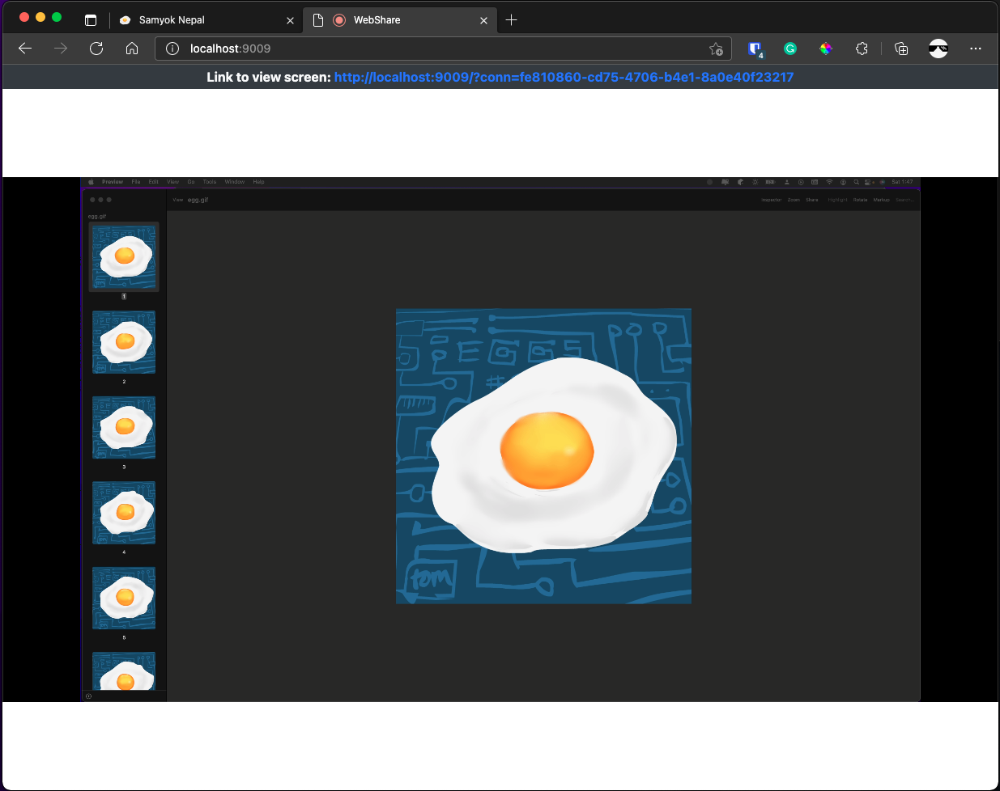

# Simple Webshare
A bare-bones screen sharing application!

It probably won't work if you're not on the same network, but it was pretty fun to learn about all the WebRTC technologies.

## How to run
1. `git clone https://github.com/samyok/webshare`
2. `yarn # (or npm install)`
3. `node server.js`
4. Go to https://localhost:9009 in your browser.
